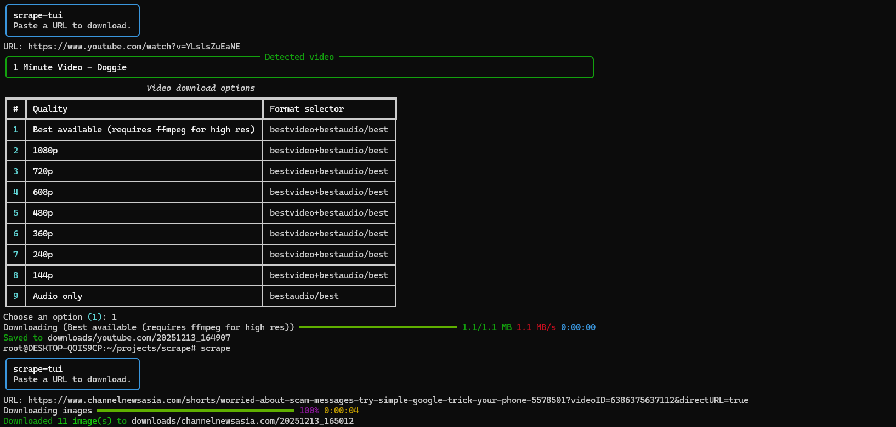

# allinonescraper

All‑in‑one downloader TUI for videos + images. Paste a URL, pick a quality (for videos), and it saves the result to disk.



## What it can download

- Videos (via `yt-dlp`) with a quality/resolution picker
- Direct image URLs (e.g. `.jpg`, `.png`, `.webp`, etc.)
- Images from a web page (scrapes `` + common lazy-loading attributes + `srcset`)

## Install

```bash
python3 -m pip install -e .
```

Notes:
- For high-res video downloads/merges, install `ffmpeg` and ensure it is on `PATH`.

## Use

Run the app and paste a URL:

```bash
allinonescraper
```

You can also run:

```bash
scrape
```

Or without installing:

```bash
PYTHONPATH=src python3 -m scrape_tui
```

### Examples

```bash
allinonescraper https://www.youtube.com/watch?v=...
allinonescraper --mode images --max-images 50 https://example.com/article
allinonescraper --output ./downloads https://example.com/picture.jpg
```

### Options

- `--mode auto|video|images` (default: `auto`)
- `--max-images N` (when scraping a page)
- `--output PATH` (base directory; downloads go to `PATH/<domain>/<timestamp>/`)
- `--codex-autofix` (developer mode; offers `codex login --device-auth` + patch attempt)

## How it works

In `--mode auto`:

1. Probe the URL with `yt-dlp` to see if it looks like a video.
2. If it is, show a quality list and download using the selected format selector.
3. Otherwise, fall back to images:
   - If the URL is an image (or the response `Content-Type` is `image/*`), download it directly.
   - If it’s HTML, parse the page and download discovered image URLs.

Downloads are organized under `./downloads/<domain>/<timestamp>/`.

## Codex auto-fix (developer mode)

If a site breaks, run with `--codex-autofix`. On errors it will:

1. Ask permission to run Codex
2. If needed, prompt for headless login using `codex login --device-auth`
3. Run `codex exec` with the failing URL + error message
4. Ask permission to apply the generated patch via `codex apply`

This can modify your local source tree; review changes before pushing.

## Troubleshooting

- Update `yt-dlp`: `python3 -m pip install -U yt-dlp`
- Install `ffmpeg` for high-res formats (video+audio merging)
- Some sites require cookies/login; `yt-dlp` supports `--cookies-from-browser` (not wired into the TUI yet).
